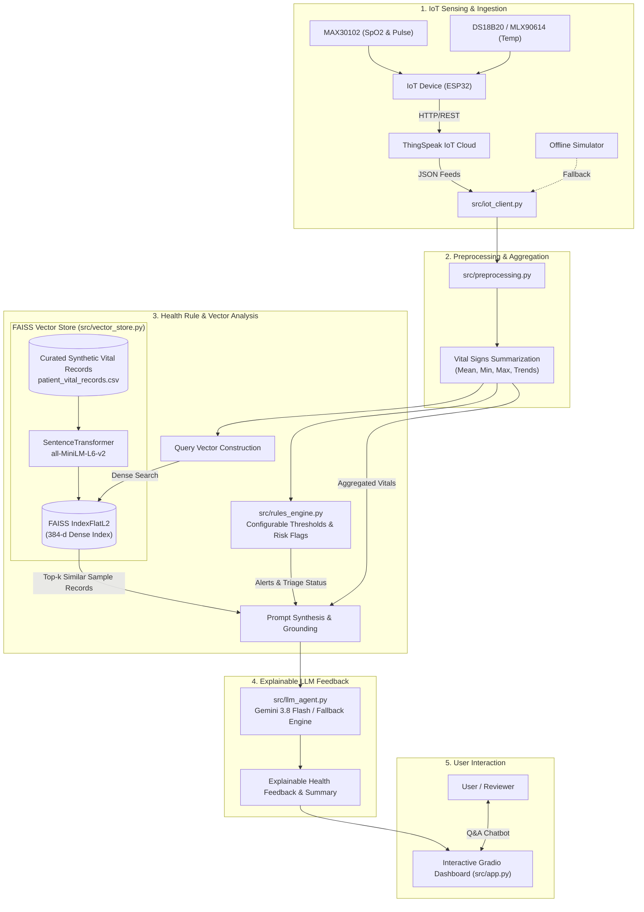

# 🩺 RAG-Enhanced IoT Health Monitoring & Explainable Feedback System

[](https://www.python.org/)
[](LICENSE)
[](#system-architecture)
[](#testing--verification)

> **Author & Maintainer**: [Ronanki Tagore](https://github.com/Tag0305)
> **Academic Context**: 7th Semester Major Project
> **Repository**: [https://github.com/Tag0305/rag-iot-health-monitoring](https://github.com/Tag0305/rag-iot-health-monitoring)

---

## 📌 Executive Summary

Developed as a **7th Semester Major Project**, this repository presents an end-to-end intelligent **health-monitoring decision-support prototype** that bridges real-time embedded sensing with explainable artificial intelligence.

While modern wearable and ambient IoT health monitors capture continuous physiological signals, raw telemetry streams alone lack automated triage reasoning, risk indicator context, and historical reference. At the same time, ungrounded Large Language Models (LLMs) risk generating misleading assertions and lack adherence to deterministic rule boundaries.

The **RAG-Enhanced IoT Health Monitoring & Explainable Feedback System** addresses this challenge by unifying five core components:
1. **IoT Health Telemetry**: Streaming real-time physiological vitals—body temperature, pulse/heart rate, and oxygen saturation (SpO₂)—via ThingSpeak cloud REST APIs (coupled with an offline telemetry simulator for resilient edge operation).
2. **Robust Preprocessing**: Automated signal cleansing, timestamp synchronization, type coercion, and statistical rolling aggregation (mean, min, max, trend analysis).
3. **Rule-Based Risk Flagging**: A deterministic engine driven by configurable rule-based thresholds providing instant screening for individual vital anomalies (pyrexia, hypothermia, tachycardia, bradycardia, hypoxemia) as well as compound multi-vital risk indicators.
4. **FAISS Semantic Retrieval**: Dense vector-similarity retrieval across curated synthetic/sample vital records using Hugging Face sentence transformers (`all-MiniLM-L6-v2`) and a **FAISS vector index** (`IndexFlatL2`) to surface semantically similar historical/sample records.
5. **RAG/LLM-Generated Explainable Feedback**: Multi-stage reasoning powered by Gemini 3.8 Flash (with deterministic local fallbacks) that synthesizes live telemetry, rule-based alarm status, and retrieved sample records into clear, transparent, and grounded explainable health feedback and interactive conversational Q&A.
6. **Interactive Dashboard**: A responsive Gradio user interface supporting demographic input profiles, telemetry inspection, retrieval verification, and conversational health guidance.

---

## 🏗️ System Architecture



---

## 🔬 Key Engineering Highlights

### 1. Robust Preprocessing & Signal Cleansing
- **Sensor Mapping Fix**: Rectified an inverted channel mapping bug from early exploratory prototypes where temperature was mapped to SpO₂ (producing distorted 99°C temperature readings and 36% oxygen saturation). Cleanly maps:
  - `field1` &rarr; Oxygen Saturation (SpO₂ %)
  - `field2` &rarr; Heart Rate / Pulse (BPM)
  - `field3` &rarr; Body Temperature (°C)
- **Signal Cleansing**: Automated coercion, NaN filtering, and statistical rolling aggregation (mean, min, max).

### 2. Deterministic Rule Engine & Risk Flagging
Implements configurable rule-based thresholds and compound risk indicators:
| Vital Sign | Reference Range | Alert Threshold | Risk Flag / Condition | Severity |
| :--- | :--- | :--- | :--- | :--- |
| **Body Temp** | 36.1 – 37.2 °C | `> 37.5 °C` | Pyrexia / Elevated Temperature | WARNING |
| **Body Temp** | 36.1 – 37.2 °C | `< 35.0 °C` | Hypothermia Indicator | CRITICAL |
| **SpO₂** | 95.0 – 100.0% | `< 95.0%` | Mild Hypoxemia Flag | WARNING |
| **SpO₂** | 95.0 – 100.0% | `< 90.0%` | Severe Hypoxemia Flag | CRITICAL |
| **Heart Rate** | 60 – 100 BPM | `> 100 BPM` | Tachycardia Indicator | WARNING |
| **Heart Rate** | 60 – 100 BPM | `< 60 BPM` | Bradycardia Indicator | WARNING |
| **Compound** | — | `Temp > 37.5` & `SpO₂ < 95%` | Suspected Respiratory Distress Signal | WARNING |
| **Compound** | — | `HR > 100` & `SpO₂ < 95%` | Cardiopulmonary Stress Signal | CRITICAL |
| **Compound** | — | `Temp > 38.0` & `HR > 100` |  | CRITICAL High Temperature + Elevated Heart Rate Risk Flag

### 3. FAISS Vector Retrieval (RAG)
Replaced static top-50 CSV slices with a **FAISS-based similarity index**:
- Encodes synthetic health record narratives using `sentence-transformers/all-MiniLM-L6-v2` into 384-dimensional dense vectors.
- Queries `faiss.IndexFlatL2` to surface the top-$k$ most demographically and physiologically similar synthetic sample records.
- Formats retrieved records directly into Gemini's context window for grounded contextual comparisons.
- **Dataset Note**: The historical database (`patient_vital_records.csv`) consists entirely of curated, synthetic benchmark health records generated for educational testing; it contains no real patient identifiable data.

### 4. Zero-Cost Offline Resilience
- Automatically falls back to deterministic local mock telemetry and structured AI synthesis when credentials or internet access are unavailable.
- Enables complete test execution and offline demonstrations without requiring paid third-party API quotas.

---

## 📂 Repository Structure

```text
rag-iot-health-monitoring/
├── .github/
│   └── workflows/
│       └── ci.yml                     # Continuous integration (tests & linting)
├── data/
│   ├── sample_iot_feeds.json          # Curated ThingSpeak telemetry stream (synthetic sample)
│   └── patient_vital_records.csv      # 200-record synthetic health records dataset
├── src/
│   ├── __init__.py                    # Package declarations
│   ├── config.py                      # Environment config & configurable rule-based thresholds
│   ├── iot_client.py                  # ThingSpeak client + synthetic fallback
│   ├── preprocessing.py               # Data cleaning & vital aggregation
│   ├── rules_engine.py                # Deterministic rule evaluation & risk flagging
│   ├── vector_store.py                # FAISS indexing & top-k semantic retrieval
│   ├── llm_agent.py                   # Gemini 3.8 Flash agent + mock synthesizer
│   └── app.py                         # Interactive Gradio UI & chat interface
├── tests/
│   ├── __init__.py
│   ├── test_preprocessing.py          # Data cleansing & statistical tests
│   ├── test_rules_engine.py           # Single & compound rule tests
│   ├── test_vector_store.py           # FAISS indexing & retrieval tests
│   ├── test_iot_client.py             # Telemetry fetch & fallback tests
│   └── test_llm_agent.py              # LLM prompt & mock synthesis tests
├── .env.example                       # Documented secrets template
├── .gitignore                         # Comprehensive git ignore rules
├── LICENSE                            # MIT Open Source License
├── pyproject.toml                     # Modern package metadata & pytest config
├── requirements.txt                   # Python project dependencies
└── llm_and_healthcare.ipynb           # Original reference research notebook
```

---

## 🚀 Getting Started

### 1. Prerequisites
- Python 3.10, 3.11, 3.12, 3.13, or 3.14
- Git

### 2. Installation
Clone the repository and install dependencies:
```bash
git clone https://github.com/Tag0305/rag-iot-health-monitoring.git
cd rag-iot-health-monitoring

# Create and activate virtual environment
python -m venv .venv
source .venv/bin/activate       # On Linux/macOS
# .venv\Scripts\activate        # On Windows

# Install dependencies
pip install -r requirements.txt
```

### 3. Environment Configuration
Copy the configuration template and optionally provide your API credentials:
```bash
cp .env.example .env
```
Edit `.env`:
```env
# Optional: Needed for live Gemini AI generation (get at https://aistudio.google.com/)
GEMINI_API_KEY=your_gemini_api_key_here
GEMINI_MODEL=gemini-3.8-flash

# Optional: ThingSpeak IoT Channel (mock telemetry is used if omitted)
THINGSPEAK_CHANNEL_ID=your_channel_id
THINGSPEAK_READ_API_KEY=your_read_key
```
*(Note: If no keys are provided, the system runs automatically in deterministic offline fallback mode).*

---

## 🧪 Testing & Verification

Run the automated test suite with `pytest`:
```bash
python -m pytest -v --tb=short
```

Test coverage includes:
- **Preprocessing**: Channel mapping, dirty string coercion, null-row dropping, and statistical calculations.
- **Rules Engine**: Normal ranges, pyrexia, hypothermia, bradycardia, tachycardia, hypoxemia, compound risk flags, and configurable rule-based thresholds.
- **Vector Store**: FAISS embedding generation, index dimensions (384-d), top-k distance ranking, and prompt formatting.
- **IoT Ingestion**: Live HTTP calls, graceful offline fallback, and synthetic feed generation.
- **LLM Agent**: Prompt assembly, sample record grounding context, and deterministic mock synthesis.

---

## 🖥️ Running the Application

Launch the interactive web application:
```bash
python src/app.py
```
Open your browser at `http://127.0.0.1:7860`.

### UI Workflow:
1. Adjust **Patient Demographics** (Age, Gender, Weight, Height).
2. Enter your **ThingSpeak Channel ID** or keep **Offline Mode** selected.
3. Click **⚡ Run Telemetry & RAG Analysis**.
4. Inspect:
   - **Telemetry & Rules**: Summary statistics and risk indicator status (`NORMAL`, `WARNING`, `CRITICAL`).
   - **Vector Retrieval**: Top-k matching sample records from the 200-record synthetic dataset.
   - **Gemini Explainable AI**: Explainable health feedback with contextual rationale and monitoring recommendations.
5. Engage with the **Conversational Health Assistant** to ask questions regarding symptoms, trends, and risk factors.

---

## ⚠️ Medical Disclaimer

> **IMPORTANT**: Research and educational demonstration only. This application is not a medical device and is not intended to diagnose, treat, or replace professional medical advice.

---

## 📄 License

Distributed under the [MIT License](LICENSE). See `LICENSE` for more information.